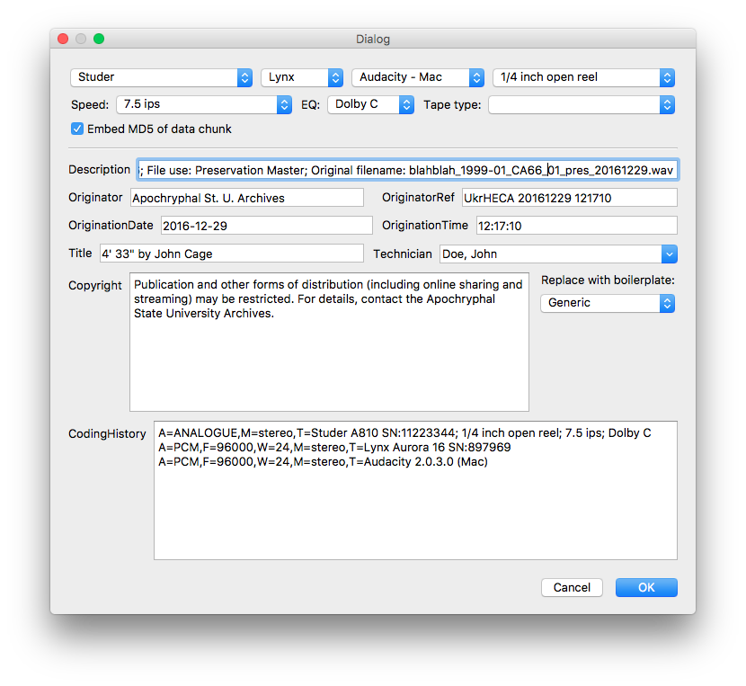

# autoBWF

## A GUI tool for adding de novo BWF internal metadata to freshly-created WAV files. 

autoBWF uses system calls to the FADGI BWFMetaEdit command line under the hood, and is meant to be a replacement for the BWFMetaEdit GUI for initial metadata creation. Unlike BWFMetaEdit, autoBWF is extremely opinionated and automatically generates and pre-fills metadata content based on the file name and system metadata using the conventions of the Ukrainian History and Education Center Archives audio collections. It has a relatively self-explanatory JSON configuration file that can be edited to include pre-set data for audio hardware, software, and copyright statements. However, it is relatively kludgy, and will likely require somebody knowledgeable in Python to get it running in a useful manner at your institution.

autoBWF will not edit or overwrite existing BWF metadata. Please use the FADGI BWFMetaEdit GUI for that purpose.

The bwfmetaedit "--accept-nopadding" flag is used by default, but that behavior can be changed in the configuration file.

Requires Python 3, PyQt 4.8, and the FADGI BWFMetaEdit CLI. It assumes that the "bwfmetaedit" executable is in the current PATH.

### Usage

python autoBWF.py *filename* [-t *template_filename*]

Including the -t flag will prepopulate Title, Technician, Copyright, and Coding History with the corresponding BWF metadata from the template file.

## Screenshot

