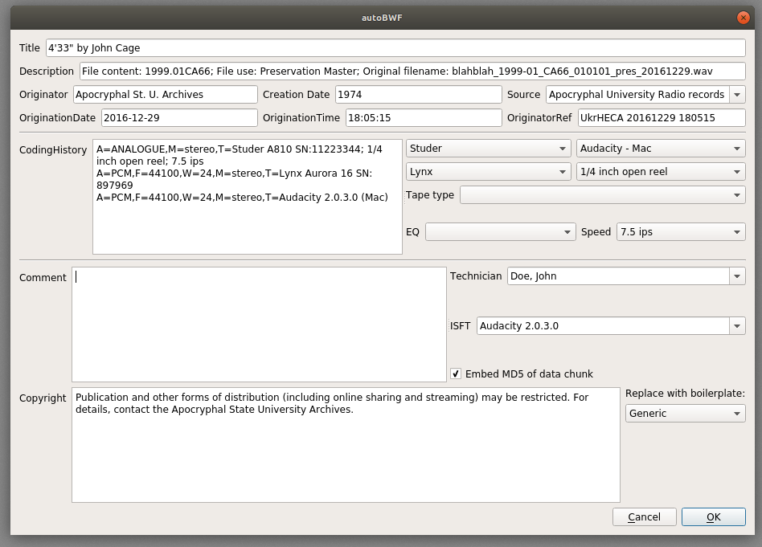

# autoBWF

## A GUI tool for automatically generating and editing BWF metadata

The purpose of autoBWF is to provide an alternative GUI for embedding internal metadata in WAVE audio files using the [Broadcast Wave](https://en.wikipedia.org/wiki/Broadcast_Wave_Format) standard and the FADGI [BWFMetaEdit](https://mediaarea.net/BWFMetaEdit). Unlike the existing BWFMetaEdit GUI, autoBWF is extremely opinionated and will try to automatically generate metadata content based on file naming conventions and system metadata. In addition, it can copy metadata fields from a template file to avoid having to enter the same information multiple times for several master or derivative files of the same physical instantiantion.

### Requirements

This code requires Python 3, PyQt 5, and [BWFMetaEdit](https://mediaarea.net/BWFMetaEdit/Download) CLI. It assumes that the "bwfmetaedit" executable is in the current PATH. It has been tested on Linux and Mac OS using bwfmetaedit version 1.3.3. If you want to run on Windows, then you're on your own...

### Usage

python autoBWF.py *target_filename* [-t *template_filename*]

autoBWF will prepopulate the Description, Originator, OriginationDate, OriginationTime, and OriginatorRef GUI elements with reasonable guesses as described below. If *target_filename* already contains BWF metadata, then those values will appear in the GUI in grey italic text. If the user edits those fields, the text color will change to red as a warning that the values will be overwritten in the target file after clicking "Ok". **This cannot be undone!** You have been warned...

The CodingHistory text is generated automatically based on the selections made in the drop-downs to the right of the text box. You can also edit the text manually, but be aware that using the drop-down menus will undo any manual edits that you have made. Similarly, the Copyright text is replaced with the boilerplate corresponding to the dropdown menu selection. The same caveat regarding manual editing holds here as well.

Including the optional -t flag will prepopulate the contents of the Title, Technician, Source, Copyright, and Coding History text fields with the corresponding BWF metadata contained in *template_filename*. These can always be edited before updating the metadata in the target file.

It is strongly recommended that you play around using test files and confirm using BWFMetaEdit that autoBWF is behaving the way that you expect before working with preservation or production master files.

### Configuration

You can edit the file config.json to customize the values in the dropdown menus and other program behavior to the needs of your use case. In particular, it contains the model, serial number, and software version strings that go into constructing the CodingHistory element, as well as the copyright boilerplate texts. 

The bwfmetaedit "--accept-nopadding" flag is used by default, but that behavior can also be changed in the configuration file.

### Metadata fields

The text box labels in the GUI correspond directly to BWF metadata field names, with the exception of the following:

| autoBWF label | BWF field name |
| --- | --- |
| Title | INAM |
| Technician | ITCH |
| Copyright | ICOP |
| Creation Date | ICRD |
| Source | ISRC |
| Comment | ICMT |

#### Automatic metadata generation details

 The code assumes that filenames follow the convention of Indiana University Archives of Traditional Music as described in the ["Sound Directions" publication](http://www.dlib.indiana.edu/projects/sounddirections/papersPresent/index.shtml). If the naming convention at your archives is different, then you may be able to make things work by modifying the regex string in config.json, or more substantial customization to the Python code may need to be made. The values of Description, Originator, OriginationDate, OriginationTime, and OriginatorRef are prefilled based on parsing the filename and using file creation date and times obtained from OS metadata together with default values in config.json. If there is a conflict between the OS metadata date and that in the filename, then the program will display a warning and will allow you to choose which one you want to use. If the program cannot parse the filename, then it will display a warning, use the OS file creation date and time to generate OriginationDate, OriginationTime, and OriginatorRef, and will leave Description blank.
