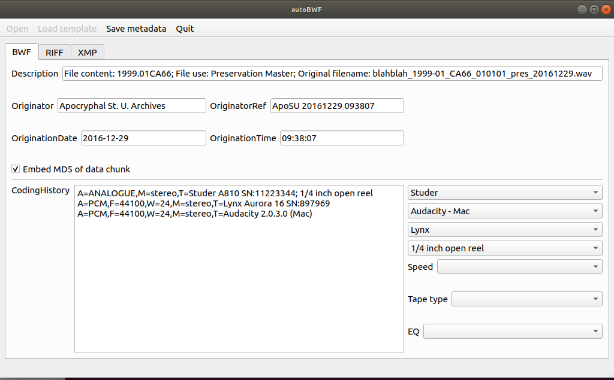

# autoBWF

## A GUI tool for automatically generating and editing BWF metadata

The purpose of autoBWF is to provide an alternative GUI for embedding internal metadata in WAVE audio files using the [Broadcast Wave](https://en.wikipedia.org/wiki/Broadcast_Wave_Format) standard, FADGI [BWFMetaEdit](https://mediaarea.net/BWFMetaEdit), and [XMP](https://en.wikipedia.org/wiki/Extensible_Metadata_Platform). 

Unlike the existing BWFMetaEdit GUI, autoBWF is extremely opinionated and will automatically generate metadata content based on file naming conventions and system metadata. In addition, it can copy metadata fields from a template file to avoid having to enter the same information multiple times for several master or derivative files of the same physical instantiantion.

Also included are two command line programs to simplify the creation of derivative files. `autolame.py` is a wrapper for the `lame` MP3 encoder that automatically transfers Wave BWF, RIFF, and XMP metadata to appropriate ID3v2 and XMP. `autosplice` is a wrapper that generates `sox` commands from an EDL-like text file to splice audio from multiple input files, while also 
### Requirements

This code requires 
* Python 3
* PyQt 5 
* [Python XMP Toolkit](http://python-xmp-toolkit.readthedocs.io/en/latest/index.html#) ([github](https://github.com/python-xmp-toolkit/python-xmp-toolkit))
  * which in turn requires the [Exempi library](https://libopenraw.freedesktop.org/wiki/Exempi/)
* [BWFMetaEdit](https://mediaarea.net/BWFMetaEdit/Download) CLI 
* [lame](http://lame.sourceforge.net/) (for autolame.py)
* [SoX](http://sox.sourceforge.net/) v14.4.2 (for autosplice.py)

It assumes that the "bwfmetaedit" executable is in the current PATH. It has been tested on Linux using bwfmetaedit version 1.3.3. It should also run on Unix-like systems such as MacOS. 

If you are a Windows user, then you're on your own... Windows users may face challenges getting Exempi installed. You may be better off using the [2.1 version](https://github.com/Ukrainian-History/autoBWF/releases/tag/v2.1) for BWF and RIFF editing without XMP. 

### `autoBWF` usage

`python autoBWF.py`

Alternatively, you can avoid using the "Open" dialog by specifying the target file and (optional) template file on the command line:

`python autoBWF.py <target_filename> [-t <template_filename>]`

`autoBWF` will prepopulate the Description, Originator, OriginationDate, OriginationTime, and OriginatorRef GUI elements with reasonable guesses as described below. If *target_filename* already contains BWF metadata, then those values will appear in the GUI in grey italic text. If the user edits those fields, the text color will change to red as a warning that the values will be overwritten in the target file after clicking "Save metadata". **This cannot be undone!** You have been warned...

The CodingHistory text is generated automatically based on the selections made in the drop-downs to the right of the text box. You can also edit the text manually, but be aware that using the drop-down menus will undo any manual edits that you have made. Similarly, the Copyright text is replaced with the boilerplate corresponding to the dropdown menu selection. The same caveat regarding manual editing holds here as well.

Loading a template file (either using the "Load Template" button or using the optional `-t` command line argument) will prepopulate the contents of the Title, Technician, Source, Copyright, Coding History, and any XMP text fields with the corresponding metadata contained in *template_filename*. These can always be edited before updating the metadata in the target file.

It is strongly recommended that you play around using test files and confirm (using BWFMetaEdit and/or an internal metadata viewer like exiftool) that autoBWF is behaving the way that you expect before working with preservation or production master files.

#### Configuration

You can edit the file config.json to customize the values in the dropdown menus and other program behavior to the needs of your use case. In particular, it contains the model, serial number, and software version strings that go into constructing the CodingHistory element, as well as the copyright boilerplate texts. 

The bwfmetaedit `--accept-nopadding` flag is used by default, but that behavior can also be changed in the configuration file.

#### Automatic metadata generation details

 The code assumes that filenames follow the convention of Indiana University Archives of Traditional Music as described in the ["Sound Directions" publication](http://www.dlib.indiana.edu/projects/sounddirections/papersPresent/index.shtml). If the naming convention at your archives is different, then you may be able to make things work by modifying the regex string in config.json, or more substantial customization to the Python code may need to be made. The values of Description, Originator, OriginationDate, OriginationTime, and OriginatorRef are prefilled based on parsing the filename and using file creation date and times obtained from OS metadata together with default values in config.json. If there is a conflict between the OS metadata date and that in the filename, then the program will display a warning and will allow you to choose which one you want to use. If the program cannot parse the filename, then it will display a warning, use the OS file creation date and time to generate OriginationDate, OriginationTime, and OriginatorRef, and will leave Description blank.

#### Known issues

* Does not remove existing XMP metadata fields (i.e. setting a field to "" causes the existing data to remain unchanged)
* For some reason, XMP dc:description shows up as RIFF ISBJ in BWFMetaEdit. This may or may not be a bug...
* Quotation marks in text fields are not escaped and will prevent that text from being saved

### `autolame` usage

`python autolame.py [--vbr-level n] <infile> <outfile>`

The default VBR level is currently 6.

### `autosplice` usage

`python autosplice.py <EDL file>`

where `<EDL file>` is a text file vaguely reminiscent of an [edit decision list](https://en.wikipedia.org/wiki/Edit_decision_list).

Specifically, the input file consists of any number of lines of the form

`filename.wav <in-time> <out-time>`
 
 which may also optionally contain `fade <in duration> <out duration>` and/or `pad <start padding> <end padding>`. This will append the audio in `filename.wav` from time `<in-time>` to time `<out-time>` (relative to start of the file). All times and durations are in SoX time specification syntax (see the Sox man page for details). The optional `fade` and `pad` parameters add fade in and/or fade out (both values are required: set either to zero if no fade is desired), or padding with silence at beginning and/or end (both values are required: set either to zero if no padding is desired). Padding is added before fade in and after fade out.
 
 The input file must end with a line containing only a filename, and optionally the text `contrast <value>`, but no in or out times. This specifies the name of the output file, as well as any optional Sox "contrast" (a form of audio dynamic range compression).
 
See `autosplice-example.txt` for an example of an `autosplice` input file. 

## Security warning
The code here is a wrapper for a number of external command-line programs (`bwfmetaedit`, `lame`, and `sox`). It calls these programs using unsanitized strings passed to the Python `subprocess.call()` function with the `shell=True` parameter set. This is obviously a potential security hole. If you are dealing only with Wave files generated within your repository by trusted users, then the risk is minimal. However, it is conceivable that a Wave file obtained from an untrusted outside source could result in injection attacks or other nastiness via maliciously-crafted metadata. If you are dealing with such files, then you should check any existing metadata using another tool (e.g. `exiftool` or `BWFMetaEdit`) to make sure there is nothing unusual.